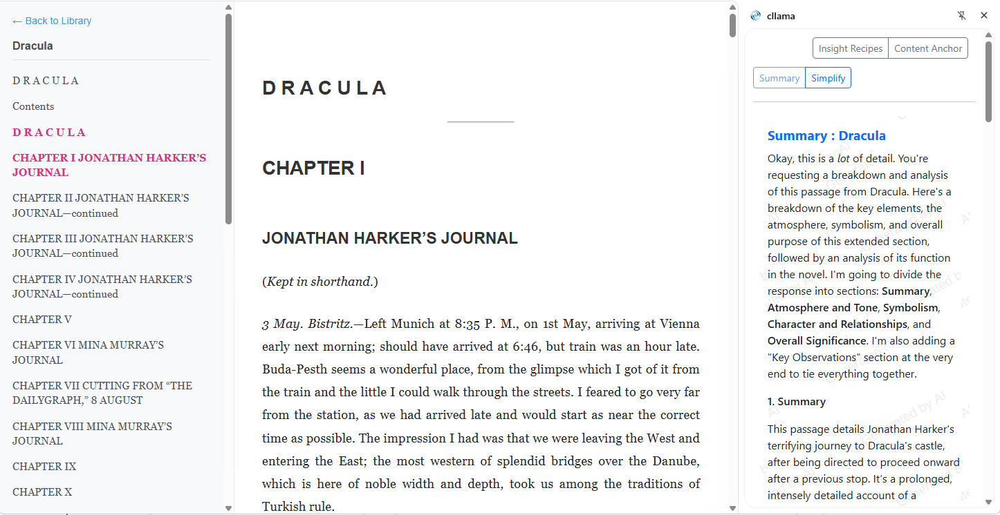
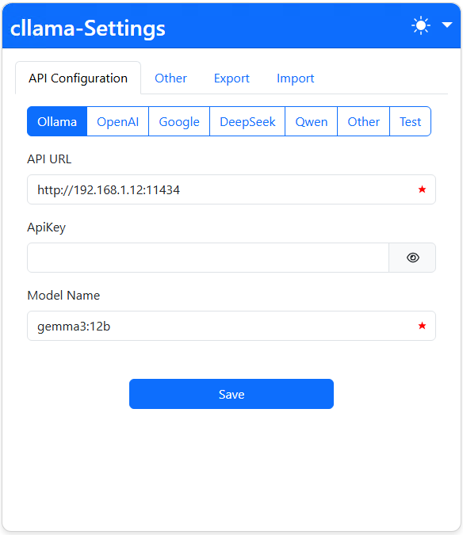
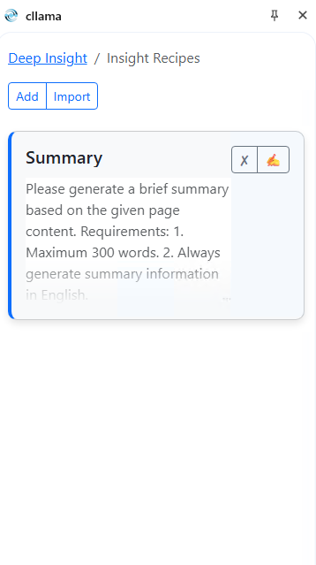
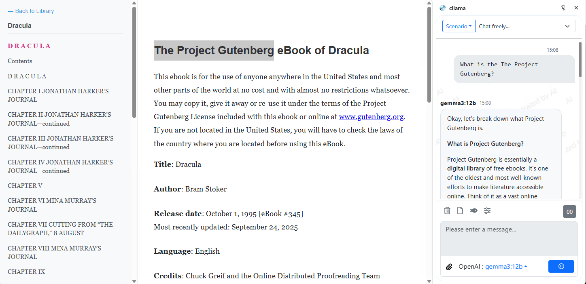

# reader 3 Dockerized with cllama Web-Extension



A Dockerized version of [reader3](https://github.com/karpathy/reader3) with fixes for pickle compatibility and improved preprocessing. Easily run an EPUB reader web server with Docker.

## Features
- Lightweight EPUB reader for reading books chapter by chapter.
- Docker container for easy deployment.
- Compatible with LLM integrations (e.g., copy-paste chapters to chatbots).
- Fixed pickle loading issues for cross-environment compatibility.
- Automatic preprocessing of EPUB files on container start.
- Optimized for use with the cllama Chrome/Firefox extension for enhanced LLM interactions.

## Usage

### Prerequisites
- Docker installed on your system (Docker Desktop for Windows/Mac).
- EPUB files to read (place them in a local directory, e.g., `~/books`).
- Optional: cllama extension for browser integration.

### Quick Start
1. Clone this repo:

```bash 
git clone -b feature/docker-setup --single-branch \
  https://github.com/lsunay/reader3-docker.git
  cd reader3-docker
 ```
2. Place your EPUB files in a local directory (e.g., `~/books`).
3. Build the Docker image:

```bash
docker build -t reader3-docker . 
``` 
4. Run the container:
```bash
docker run -d --name reader3 -p 8123:8123 -v ~/books:/app/books reader3-docker
```
or with detailed user specifications:
```bash
docker run -d \
  --name reader3 \
  --user 1000:1000 \
  -p 8123:8123 \
  -v /path/on/host/books:/app/books \
  -v $(pwd)/data:/app/data \
  reader3
```
 or run with docker-compose
 ```bash
 docker compose up --build -d
 ```
  
5. Open `http://localhost:8123 in your browser to access the library.

### Adding New Books
- Add new EPUB files to the mounted directory (e.g., `~/books`).
- Restart the container: `docker restart reader3`.
- The container will preprocess only new books (skipping already processed ones).

### Chrome-Firefox Extension Integration (cllama Example)
- Use with Chrome-Firefox extensions like cllama for enhanced reading and LLM integration.
- Install the cllama extension from [Firefox Add-ons](https://addons.mozilla.org/tr/firefox/addon/cllama/) or [Chrome Add-ons](https://chromewebstore.google.com/detail/cllama/nfkhleipggbeadfdaonpjaggcpidjmka).
- Go to the settings and define your local LLM endpoint or enter provider credintials.(e.g., ChatGPT or Claude).
 
- Go to the Deep-insight menu and add custom insight receipts.
 
- After making all settings and custom insights prompts, click the cllama plugin, choose the Deep Insight. The sidebar opens in the web browser; you don't have to copy-paste or enter any prompts. Just click the insights and see the results in the sidebar. 
 
- You can also use Smart-Chat section of cllama and ask anything or copy specific part of the page. 
  
- For best results, pair with AI tools for summarizing or discussing books.
- cllama extension support page https://fxdq.net/cllama/en/index.html
- The developer of the cllama web extension will create a GitHub page soon. Currently, it does not have an Android version. Personally, I transformed it into a Firefox Android version with a self-signed certificate for my personal use. If anyone needs it, please like and fork this repo and write a comment.
## Supported Systems
- Linux, Windows (with Docker Desktop), and macOS.
- Requires Docker. For Windows, install Docker Desktop from https://www.docker.com/products/docker-desktop .

## Troubleshooting
- Books not loading? Ensure EPUB files are in the mounted directory and permissions are set (e.g., sudo chown -R 1000:1000 /path/to/books).
- Port conflict? Change -p 8123:8123 to another port, e.g., -p 8124:8123.
- Build errors? Ensure Docker is up-to-date and you have internet access for cloning.
- Extension issues? Check cllama settings for correct API keys or endpoints.

## Files
- `Dockerfile`: Builds the Docker image with fixes.
- `docker-entrypoint.sh`: Handles preprocessing and server startup.
- `server.py`: Server code with pickle fixes.
- `reader3.py`: Preprocessor with dynamic output dir support.
-  docker-compose.yml: Docker Compose configuration for easy setup.
- `README.md`: This file.

## Contributing
- Fork the repo and submit pull requests for improvements.

## License
- Same as original reader3 (MIT-like, check original repo).

## Credits
- Based on [karpathy/reader3](https://github.com/karpathy/reader3).
- Fixes and Dockerization by lsunay.

